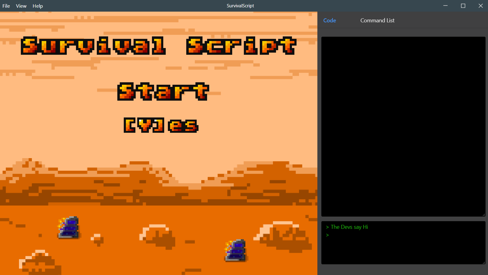

#  Script Survival

> An engaging game to teach beginners how to read documentation
> 

Script Survival was created at Purdue's Hello World 2019 24 hour Hackathon. The goal of the project is to teach
beginners of programming how to read documentation, since we belive many learning resources don't actually teach you how to keep learning once you finish the resource.

## Getting Started

## Contributors

-   **Nicolas Newman** - UI Implementation, Redux Managment - [NicolasNewman](https://github.com/NicolasNewman)
-   **Avanish Subbiah** - Game World and Movement, Tilesets and maps - [avanishsubbiahs](https://github.com/avanishsubbiahs)
-   **Justin Qualley** - Game Design, Game Logic, etc - [justinqualley](https://github.com/justinqualley)
-   **Firstname Lastname** - First job, more jobs, etc - [GithubUsername](https://github.com/GithubUsername)
